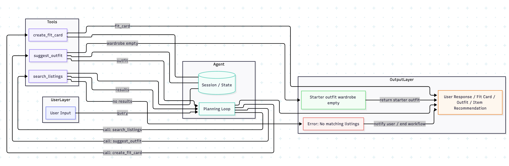

# FitFindr — planning.md

> Complete this document before writing any implementation code.
> Your spec and agent diagram are what you'll use to direct AI tools (Claude, Copilot, etc.) to generate your implementation — the more specific they are, the more useful the generated code will be.
> Your planning.md will be reviewed as part of your submission.
> Update it before starting any stretch features.

---

## Tools

List every tool your agent will use. For each tool, fill in all four fields.
You must have at least 3 tools. The three required tools are listed — add any additional tools below them.

### Tool 1: search_listings

**What it does:**
<!-- Describe what this tool does in 1–2 sentences -->
Searches listings.json for secondhand clothing items that match a user's description, size, and budget. The tool filters listings using keywords from the description, checks size compatibility, and removes items above the user's maximum price.
**Input parameters:**
<!-- List each parameter, its type, and what it represents -->
- `description` (str): Keywords or natural language describing the item the user wants (e.g., "vintage graphic tee", "baggy jeans", "black jacket").
- `size` (str): Desired clothing size entered by the user (e.g., "M", "L", "W30", "US 8").
- `max_price` (float): Maximum amount the user is willing to spend.

**What it returns:**
<!-- Describe the return value — what fields does a result contain? -->
Returns a list of listing dictionaries sorted by relevance.

Each listing contains:
{
    "id": str,
    "title": str,
    "description": str,
    "category": str,
    "style_tags": list[str],
    "size": str,
    "condition": str,
    "price": float,
    "colors": list[str],
    "brand": str | None,
    "platform": str
}
**What happens if it fails or returns nothing:**
<!-- What should the agent do if no listings match? -->
If no matching listings are found:

1. Return an empty list.
2. The planning loop stores: session["error"] = "No matching listings found."
3. The agent responds: "I couldn't find any items matching that description within your budget and size. Try increasing your budget, changing the size, or using broader keywords."
4. The workflow ends without calling any additional tools.
---

### Tool 2: suggest_outfit

**What it does:**
<!-- Describe what this tool does in 1–2 sentences -->
Combines a selected secondhand item with pieces from the user's wardrobe to create one or more complete outfits. The tool attempts to match colors, categories, and style tags.
**Input parameters:**
<!-- List each parameter, its type, and what it represents -->
- `new_item` (dict): Listing selected from search results.
- `wardrobe` (dict): User wardrobe following wardrobe_schema.json.

**What it returns:**
<!-- Describe the return value -->
Returns an outfit recommendation dictionary:
{
    "new_item": dict,
    "top": dict | None,
    "bottom": dict | None,
    "outerwear": dict | None,
    "shoes": dict | None,
    "accessories": list[dict],
    "style_reasoning": str
}

**What happens if it fails or returns nothing:**
<!-- What should the agent do if the wardrobe is empty or no outfit can be suggested? -->
If wardrobe is empty:
1. Return a starter outfit containing only the new item.
2. Add styling advice based on item category.
Example:
"You don't have any wardrobe items saved yet. This tee would pair well with baggy jeans and white sneakers."

If wardrobe lacks matching categories:
1. Return the best partial outfit available.
2. Explain which categories are missing.
---

### Tool 3: create_fit_card

**What it does:**
<!-- Describe what this tool does in 1–2 sentences -->
Creates a short shareable social-media style outfit summary using the outfit generated by suggest_outfit().
**Input parameters:**
<!-- List each parameter, its type, and what it represents -->
- `outfit` (dict): Outfit recommendation generated by suggest_outfit.

**What it returns:**
<!-- Describe the return value -->
Returns a dictionary with key:value of fit_card:outfit caption. Different outfits generate different captions.
{
    "fit_card": str
}
**What happens if it fails or returns nothing:**
<!-- What should the agent do if the outfit data is incomplete? -->
If required outfit pieces are missing:
1. Generate a simplified fit card using available pieces.
2. Include a note indicating the outfit is incomplete.

Example:

"Vintage graphic tee styled as the centerpiece of a casual streetwear look. Add your favorite jeans and sneakers to complete the fit."

---

### Additional Tools (if any)

<!-- Copy the block above for any tools beyond the required three -->

---

## Planning Loop

**How does your agent decide which tool to call next?**
<!-- Describe the logic your planning loop uses. What does it look at? What conditions change its behavior? How does it know when it's done? -->
The agent first determines what the user is asking for. Users may want:

* A secondhand clothing recommendation
* An outfit suggestion using an item and their wardrobe
* A fit card for an existing outfit
* Any combination of the above

### Case 1: User wants secondhand clothing recommendations

1. Receive the user's request.

2. Extract:

   * description of desired item
   * size (if needed)
   * maximum budget (if provided)

3. Check whether a size is required and provided.

   * If size is missing:

     * Ask the user for their size.
     * Stop processing until the user replies.

4. Call:

   search_listings(description, size, max_price)

5. Check the returned list.

   * If the list is empty:

     * Store an error message in session state:
       session["error"] = "No matching listings found"
     * Tell the user:
       "I couldn't find any items matching your description, size, and budget. Try increasing your budget or broadening your search."
     * End the workflow.

6. If results are returned:

   * Store them:
     session["search_results"] = results
   * Select the recommended item:
     session["selected_item"] = results[0]

7. Determine whether the user also wants styling help.

   * If yes, continue to Case 2 using the selected item.
   * If no, return the recommended item and end the workflow.

---

### Case 2: User wants an outfit suggestion

1. Determine the item to style.

   * If a secondhand item was selected in Case 1:

     * Use session["selected_item"].
   * Otherwise:

     * Use the item provided by the user.

2. Call:

   suggest_outfit(
   item,
   wardrobe
   )

3. Check the outfit result.

   * If the wardrobe is empty:

     * Return a starter outfit recommendation.
   * Otherwise:

     * Store:
       session["outfit"] = outfit

4. Determine whether the user also wants a fit card.

   * If yes, continue to Case 3.
   * If no, return the outfit suggestion and end the workflow.

---

### Case 3: User wants a fit card

1. Determine the outfit to use.

   * If an outfit was generated in Case 2:

     * Use session["outfit"].
   * Otherwise:

     * Use the outfit information provided by the user.

2. Call:

   create_fit_card(
   outfit,
   item
   )

3. Store:
   session["fit_card"] = fit_card

4. Return the fit card to the user.

5. Workflow complete.

---

## State Management

**How does information from one tool get passed to the next?**
<!-- Describe how your agent stores and accesses state within a session. What data is tracked? How is it passed between tool calls? -->
The agent stores information in a session dictionary that exists for the duration of a user interaction.

Example:

session = {
"description": "",
"size": "",
"max_price": 0,
"search_results": [],
"selected_item": None,
"outfit": None,
"fit_card": "",
"error": None
}

Data flow:

1. User query populates:

   * description
   * size
   * max_price

2. search_listings() stores:

   * search_results

3. The first matching item becomes:

   * selected_item

4. suggest_outfit() uses:

   * selected_item
   * wardrobe

5. suggest_outfit() stores:

   * outfit

6. create_fit_card() uses:

   * outfit
   * selected_item

7. create_fit_card() stores:

   * fit_card

Because information is stored in session state, the user does not need to re-enter information between tool calls.

---

## Error Handling

For each tool, describe the specific failure mode you're handling and what the agent does in response.

| Tool | Failure mode | Agent response |
|------|-------------|----------------|
| search_listings | No results match the query | Store an error message in session state and tell the user: "I couldn't find any items matching that description, size, and budget. Try increasing your budget, changing the size, or using broader keywords." End the workflow without calling additional tools. |
| suggest_outfit | Wardrobe is empty | Return a starter outfit suggestion using only the new item. Tell the user: "You don't have any wardrobe items saved yet, so here's a general styling recommendation." Continue to create_fit_card(). |
| suggest_outfit | Wardrobe is empty | Create the best partial outfit possible and explain which categories are missing. Example: "I found matching shoes but no bottoms that fit this style." Continue workflow. |
| create_fit_card | Outfit input is missing or incomplete | Generate a simplified fit card using available outfit pieces and tell the user that additional wardrobe items would improve the recommendation. |

---

## Architecture

<!-- Draw a diagram of your agent showing how the components connect:
     User input → Planning Loop → Tools (search_listings, suggest_outfit, create_fit_card)
                                                                          ↕
                                                                   State / Session
     Show what triggers each tool, how state flows between them, and where error paths branch off.
     ASCII art, a Mermaid diagram (https://mermaid.js.org/syntax/flowchart.html), or an embedded
     sketch are all fine. You'll share this diagram with an AI tool when asking it to implement
     the planning loop and each individual tool. -->

---

## AI Tool Plan

<!-- For each part of the implementation below, describe:
     - Which AI tool you plan to use (Claude, Copilot, ChatGPT, etc.)
     - What you'll give it as input (which sections of this planning.md, your agent diagram)
     - What you expect it to produce
     - How you'll verify the output matches your spec before moving on

     "I'll use AI to help me code" is not a plan.
     "I'll give Claude my Tool 1 spec (inputs, return value, failure mode) and ask it to implement
     search_listings() using load_listings() from the data loader — then test it against 3 queries
     before trusting it" is a plan. -->
**AI Tool**
Claude Code

**Milestone 3 — Individual tool implementations:**
search_listings()

Input provided to the AI tool:
* Tool 1: search_listings specification from planning.md
* Error Handling section 
* listings.json dataset structure
* Function stub and docstring from tools.py*

Expected output:
* A completed search_listings() function
* Uses load_listings() from utils/data_loader.py
* Filters listings by description keywords
* Filters by size when a size is provided
* Filters by maximum price
* Returns a list of matching listing dictionaries
* Returns an empty list when no matches are found

Verification:
1. Run pytest tests/test_tools.py.
2. Test a query that should return multiple results.
3. Test a query that should return no results.
4. Test that all returned items are below max_price.
5. Confirm the function returns [] rather than raising an exception when no matches exist.

suggest_outfit()

Input provided to the AI tool:
* Tool 2: suggest_outfit specification from planning.md
* wardrobe_schema.json
* Example wardrobe
* Error Handling section
* Function stub and docstring from tools.py

Expected output:
* A completed suggest_outfit() function
* Uses Groq llama-3.3-70b-versatile
* Creates outfit recommendations using the selected item and wardrobe
* Handles empty wardrobes gracefully
* Returns a structured outfit suggestion

Verification:
1. Test with the example wardrobe.
2. Test with an empty wardrobe.
3. Test with a wardrobe missing categories such as shoes or accessories.
4. Confirm the function returns a useful recommendation instead of crashing.
5. Confirm the return format matches the planning.md specification.

create_fit_card()

Input provided to the AI tool:
* Tool 3: create_fit_card specification from planning.md
* Example outfit outputs
* Error Handling section
* Function stub and docstring from tools.py

Expected output:
* A completed create_fit_card() function
* Uses Groq llama-3.3-70b-versatile
* Produces short social-media style captions
* Handles incomplete outfit data
* Produces different captions for different outfits

Verification:
1. Test with a complete outfit.
2. Test with incomplete outfit information.
3. Test with an empty outfit string.
4. Run the function multiple times on the same outfit and verify outputs vary.
5. Increase temperature if outputs are too repetitive.

Tool Testing

After implementing all three tools, create tests/test_tools.py.

Tests will include:
* search_listings returns results
* search_listings returns an empty list for impossible searches
* search_listings respects price limits
* suggest_outfit handles empty wardrobes
* create_fit_card handles incomplete outfit inputs

Run:
pytest tests/

All tests must pass before moving to Milestone 4.

**Milestone 4 — Planning loop and state management:**

Input provided to the AI tool:
* Planning Loop section from planning.md
* State Management section from planning.md
* Architecture diagram
* Error Handling section run_agent() TODO instructions in agent.py

Expected output:
* A completed run_agent() function
* Session state updates after every tool call
* Conditional branching based on user intent
* Conditional branching based on tool results
* Proper error handling and early returns

Verification:
1. Confirm search-only requests only call search_listings().
2. Confirm outfit-only requests only call suggest_outfit().
3. Confirm fit-card-only requests only call create_fit_card().
4. Confirm search + outfit requests call: search_listings() → suggest_outfit()
5. Confirm search + outfit + fit card requests call: search_listings() → suggest_outfit() → create_fit_card()
6. Confirm no-results searches: 
     * set session["error"]
     * do not call suggest_outfit()
     * do not call create_fit_card()
7. Print session values during testing and verify:
     * session["selected_item"] contains the exact item returned by search_listings()
     * session["outfit"] contains the exact outfit returned by suggest_outfit()
     * session["fit_card"] contains the exact output from create_fit_card()
8. Implement handle_query() in app.py and verify that session values are correctly displayed in the Gradio interface.
9. Run the complete example interaction from the planning.md walkthrough and verify state flows correctly between all tools without requiring the user to re-enter information.

The milestone is complete when the agent behaves differently depending on the user's request and tool outputs, and all state is passed through the session dictionary rather than hardcoded values.

---

## A Complete Interaction (Step by Step)

Write out what a full user interaction looks like from start to finish — tool call by tool call. Use a specific example query.

**Example user query:** "I'm looking for a vintage graphic tee under $30. I mostly wear baggy jeans and chunky sneakers. What's out there and how would I style it?"

**Step 1:**
<!-- What does the agent do first? Which tool is called? With what input? -->
The agent will first ask if the user has a preferred size for the tee. Then, search_listings gets called. The inputs are graphic vintage tee, the size, and 30$.

**Step 2:**
<!-- What happens next? What was returned from step 1? What tool is called now? -->
The matching tees are returned. Suggest new_outfit is run for each of the tees returned from Step 1. 

**Step 3:**
<!-- Continue until the full interaction is complete -->

**Final output to user:**
<!-- What does the user actually see at the end? -->
Which tees match their query and suggested outfits for each with items from their own wardrobe. 